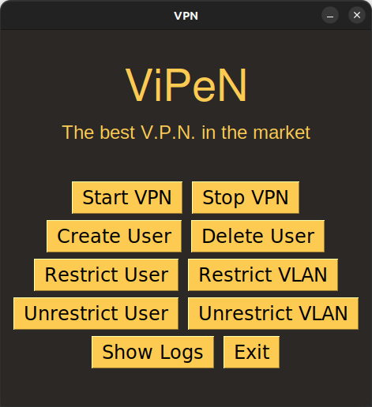

# VPN Project Documentation

## Overview

This project is a simple implementation of a VPN (Virtual Private Network) using Python. It consists of a client, two servers, and a VPN. The client sends packets in the form of UDP datagrams to the VPN, which then forwards them to the server using the user's fake ip address and port. The VPN can also restrict certain users and VLANs from accessing specific servers.

## Files

The project consists of the following files:

- `client.py`: This file contains the code for the client that sends packets to the VPN, through a GUI.
- `fact.py`: This file contains the code for a server that receives packets from the VPN and calculates the factorial of the message.
- `plus_one.py`: This file contains the code for a server that receives packets from the VPN and adds 1 to the message. 
- `vpn.py`: This file contains the code for the VPN that forwards packets from the client to the server.
- `vpn_gui.py`: This file provides a GUI to interact with the VPN.
- `utils.py`: This file contains utility functions like: assigning ip addresses and ports, logging the users in, calculating checksums and logging messages.

## Modules

### `client.py`

Firstly the client logs in, and only then it can use the VPN service. The client creates a raw socket and sends a UDP packet to the VPN. The packet contains a message and the real destination port. The client calculates the UDP checksum and includes it in the UDP header.

### `fact.py` and `plus_one.py`

The server creates a raw socket and listens for incoming packets. When it receives a packet, it unpacks the UDP header and checks the checksum. If the checksum is valid, it processes the packet. Otherwise, it discards the packet.

### `vpn.py`

The VPN creates a raw socket and listens for incoming packets. When it receives a packet, it validates the user and checks the checksum. If the user is valid and the checksum is correct, it forwards the packet to the server. Otherwise, it discards the packet.

The VPN can also restrict certain users and VLANs. Restricted users are identified by their ip address, and restricted VLANs are identified by their VLAN ID.

### `vpn_gui.py`

Through the GUI, the VPN 'owner' can register users, restrict users and vlans, see the VPN logs in a more user-friendly way

### `utils.py`

- `assign_ip_address`: assigns a random IP address and port to a user.
- `logMessage`: saves into the `logs.txt` all the vpn activity
- `udp_checksum`: Calculates the UDP checksum for a packet.
- `calc_checksum`: Calculates the checksum for a packet.

## Usage

To use this project, follow these steps:

1. Start the VPN by running `vpn_gui.py` with the "sudo python3 vpn_gui.py" command.
2. Create users and restrict users. Press start to start the VPN service.
3. Run `fact.py` and `plus_one.py` with the sudo commands to receive a packet from the VPN.
4. Run `client.py` to send the packet to the VPN.

## Dependencies

This project requires Python 3 and the following Python libraries:

- `socket`
- `struct`
- `random`
- `PySimpleGUI`

## Understanding UDP

User Datagram Protocol (UDP) is one of the core protocols of the Internet protocol suite. It is a simple, connectionless protocol that does not guarantee delivery, ordering, or error checking of data. This means that UDP does not establish a connection before sending data, does not ensure that the data is received, and does not ensure that the data is received in the same order it was sent.

Despite these limitations, UDP is used in this project for its simplicity and speed. Because UDP does not have the overhead of establishing a connection, ensuring delivery, and ensuring ordering, it is faster and simpler than connection-oriented protocols like TCP (Transmission Control Protocol). This makes UDP suitable for applications where speed is more important than reliability, such as streaming audio and video.

## UDP Datagram

A UDP datagram is composed of a header and data. The UDP header is 8 bytes long and consists of the following fields:

- Source Port (2 bytes): This is the port number of the application on the host sending the datagram.
- Destination Port (2 bytes): This is the port number of the application on the host receiving the datagram.
- Length (2 bytes): This is the length in bytes of the entire datagram (header and data).
- Checksum (2 bytes): This is used for error-checking of the header and data, simple error checking, meaning that packets that are detected as flawed ones just get discarded

The data follows the header and contains the payload of the datagram.

## Important Details

- Because UDP is a connectionless protocol, it does not establish a connection before sending data. This means that UDP does not have a three-way handshake like TCP.
- UDP does not ensure that the data is received. This means that UDP does not have acknowledgements (ACKs) or negative acknowledgements (NACKs) like TCP.
- UDP does not ensure that the data is received in the same order it was sent. This means that UDP does not have sequence numbers like TCP.
- The simplicity and speed of UDP come at the cost of reliability. Applications that use UDP must be able to handle lost, duplicate, and out-of-order packets.
- Despite its limitations, UDP is used in many important Internet protocols, including DNS (Domain Name System), DHCP (Dynamic Host Configuration Protocol), and RTP (Real-time Transport Protocol).
